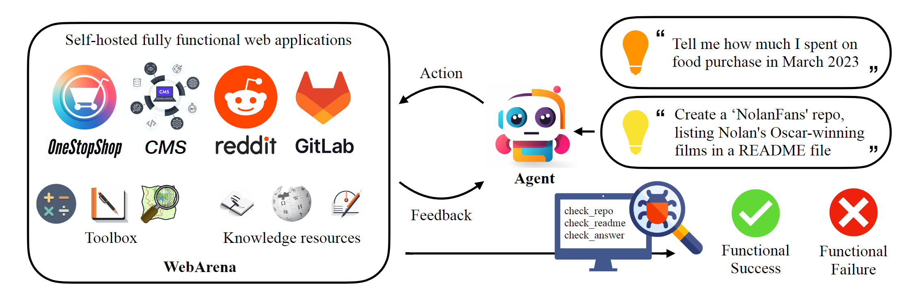

# WebArena: A Realistic Web Environment for Building Autonomous Agents
<p align="center">
    
    <br>
    <b>WebArena is a standalone, self-hostable web environment for building autonomous agents</b>
</p>


<p align="center">
<a href="https://www.python.org/downloads/release/python-3109/"></a>
<a href="https://pre-commit.com/"></a>
<a href="https://github.com/psf/black"></a>
<a href="https://mypy-lang.org/"></a>
<a href="https://beartype.readthedocs.io"></a>
</p>

<p align="center">
<a href="https://webarena.dev/">Website</a> •
<a href="https://arxiv.org/abs/2307.13854">Paper</a>
</p>




## News
* [12/21/2023] We release the recording of trajectories performed by human annotators on ~170 tasks. Check out the [resource page](./resources/README.md#12212023-human-trajectories) for more details.
* [11/3/2023] Multiple features!
  * Uploaded newest [execution trajectories](./resources/README.md#1132023-execution-traces-from-our-experiments-v2)
  * Added [Amazon Machine Image](./environment_docker/README.md#pre-installed-amazon-machine-image) that pre-installed all websites so that you don't have to!
  * [Zeno](https://zenoml.com/) x WebArena which allows you to analyze your agents on WebArena without pain. Check out this [notebook](./scripts/webarena-zeno.ipynb) to upload your own data to Zeno, and [this](https://hub.zenoml.com/project/9db3e1cf-6e28-4cfc-aeec-1670cac01872/WebArena%20Tester/explore?params=eyJtb2RlbCI6ImdwdDM1LWRpcmVjdCIsIm1ldHJpYyI6eyJpZCI6NzQ5MiwibmFtZSI6InN1Y2Nlc3MiLCJ0eXBlIjoibWVhbiIsImNvbHVtbnMiOlsic3VjY2VzcyJdfSwiY29tcGFyaXNvbk1vZGVsIjoiZ3B0NC1jb3QiLCJjb21wYXJpc29uQ29sdW1uIjp7ImlkIjoiYTVlMDFiZDUtZTg0NS00M2I4LTllNDgtYTU4NzRiNDJjNjNhIiwibmFtZSI6ImNvbnRleHQiLCJjb2x1bW5UeXBlIjoiT1VUUFVUIiwiZGF0YVR5cGUiOiJOT01JTkFMIiwibW9kZWwiOiJncHQzNS1kaXJlY3QifSwiY29tcGFyZVNvcnQiOltudWxsLHRydWVdLCJtZXRyaWNSYW5nZSI6WzAsMV0sInNlbGVjdGlvbnMiOnsibWV0YWRhdGEiOnt9LCJzbGljZXMiOltdLCJ0YWdzIjpbXX19) page for browsing our existing results!
* [10/24/2023] We re-examined the whole dataset and fixed the spotted annotation bugs. The current version ([v0.2.0](https://github.com/web-arena-x/webarena/releases/tag/v0.2.0)) is relatively stable and we don't expect major updates on the annotation in the future. The new results with better prompts and the comparison with human performance can be found in our [paper](https://arxiv.org/abs/2307.13854)
* [8/4/2023] Added the instructions and the docker resources to host your own WebArena Environment. Check out [this page](environment_docker/README.md) for details.
* [7/29/2023] Added [a well commented script](minimal_example.py) to walk through the environment setup.
## Install
```bash
# Python 3.10+
conda create -n webarena python=3.10; conda activate webarena
pip install -r requirements.txt
playwright install
pip install -e .

# optional, dev only
pip install -e ".[dev]"
mypy --install-types --non-interactive browser_env agents evaluation_harness
pip install pre-commit
pre-commit install
```
## Quick Walkthrough
Check out [this script](minimal_example.py) for a quick walkthrough on how to set up the browser environment and interact with it using the demo sites we hosted. This script is only for education purpose, to perform *reproducible* experiments, please check out the next section. In the nutshell, using WebArena is very similar to using OpenAI Gym. The following code snippet shows how to interact with the environment.
```python
from browser_env import ScriptBrowserEnv, create_id_based_action
# init the environment
env = ScriptBrowserEnv(
    headless=False,
    observation_type="accessibility_tree",
    current_viewport_only=True,
    viewport_size={"width": 1280, "height": 720},
)
# prepare the environment for a configuration defined in a json file
config_file = "config_files/0.json"
obs, info = env.reset(options={"config_file": config_file})
# get the text observation (e.g., html, accessibility tree) through obs["text"]

# create a random action
id = random.randint(0, 1000)
action = create_id_based_action(f"click [id]")

# take the action
obs, _, terminated, _, info = env.step(action)
```
## End-to-end Evaluation
1. Setup the standalone environment.
Please check out [this page](environment_docker/README.md) for details.

2. Configurate the urls for each website.
```bash
export SHOPPING="<your_shopping_site_domain>:7770"
export SHOPPING_ADMIN="<your_e_commerce_cms_domain>:7780/admin"
export REDDIT="<your_reddit_domain>:9999"
export GITLAB="<your_gitlab_domain>:8023"
export MAP="<your_map_domain>:3000"
export WIKIPEDIA="<your_wikipedia_domain>:8888/wikipedia_en_all_maxi_2022-05/A/User:The_other_Kiwix_guy/Landing"
export HOMEPAGE="<your_homepage_domain>:4399" # this is a placeholder
```

> You are encouraged to update the environment variables in [github workflow](.github/workflows/tests.yml#L7) to ensure the correctness of unit tests

3. Generate config file for each test example
```bash
poetry run python -m scripts.generate_test_data
```
You will see `*.json` files generated in [config_files](./config_files) folder. Each file contains the configuration for one test example.

4. Obtain the auto-login cookies for all websites
```
mkdir -p ./.auth
poetry run python -m browser_env.auto_login
```
5. export `OPENAI_API_KEY=your_key`, a valid OpenAI API key starts with `sk-`

6. Launch the evaluation
```bash
python run.py \
  --instruction_path agent/prompts/jsons/p_cot_id_actree_2s.json \ # this is the reasoning agent prompt we used in the paper
  --test_start_idx 0 \
  --test_end_idx 1 \
  --model gpt-3.5-turbo \
  --result_dir <your_result_dir>
```
This script will run the first example with GPT-3.5 reasoning agent. The trajectory will be saved in `<your_result_dir>/0.html`

## Develop Your Prompt-based Agent
1. Define the prompts. We provide two baseline agents whose correrponding prompts are listed [here](./agent/prompts/raw). Each prompt is a dictionary with the following keys:
```python
prompt = {
  "intro": <The overall guideline which includes the task description, available action, hint and others>,
  "examples": [
    (
      example_1_observation,
      example_1_response
    ),
    (
      example_2_observation,
      example_2_response
    ),
    ...
  ],
  "template": <How to organize different information such as observation, previous action, instruction, url>,
  "meta_data": {
    "observation": <Which observation space the agent uses>,
    "action_type": <Which action space the agent uses>,
    "keywords": <The keywords used in the template, the program will later enumerate all keywords in the template to see if all of them are correctly replaced with the content>,
    "prompt_constructor": <Which prompt construtor is in used, the prompt constructor will construct the input feed to an LLM and extract the action from the generation, more details below>,
    "action_splitter": <Inside which splitter can we extract the action, used by the prompt constructor>
    }
  }
```

2. Implement the prompt constructor. An example prompt constructor using Chain-of-thought/ReAct style reasoning is [here](./agent/prompts/prompt_constructor.py#L184). The prompt constructor is a class with the following methods:
* `construct`: construct the input feed to an LLM
* `_extract_action`: given the generation from an LLM, how to extract the phrase that corresponds to the action

## Citation
If you use our environment or data, please cite our paper:
```
@article{zhou2023webarena,
  title={WebArena: A Realistic Web Environment for Building Autonomous Agents},
  author={Zhou, Shuyan and Xu, Frank F and Zhu, Hao and Zhou, Xuhui and Lo, Robert and Sridhar, Abishek and Cheng, Xianyi and Bisk, Yonatan and Fried, Daniel and Alon, Uri and others},
  journal={arXiv preprint arXiv:2307.13854},
  year={2023}
}
```
