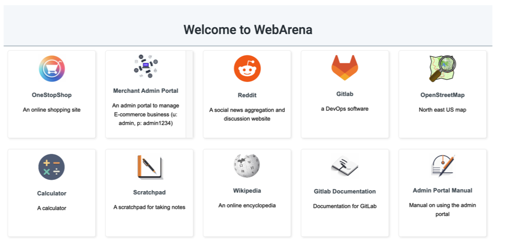

# Docker for WebArena Websites
This REAME file host the instructions for our Docker images and quick start guide for starting up websites used in WebArena.

# Table of Content
- [Pre-installed Amazon Machine Image (Recommended)](#pre-installed-amazon-machine-image-recommended)
   * [Environment reset](#environment-reset)
- [Individual Website](#individual-website)
   * [Shopping Website (OneStopShop)](#shopping-website-onestopshop)
   * [E-commerce Content Management System (CMS)](#e-commerce-content-management-system-cms)
   * [Social Forum Website (Reddit)](#social-forum-website-reddit)
   * [Gitlab Website](#gitlab-website)
   * [Wikipedia Website](#wikipedia-website)
   * [Homepage](#homepage)
   * [Map](#map)
   * [Documentation sites](#documentation-sites)

## Pre-installed Amazon Machine Image (Recommended)
We provide AMI which have all the websites pre-installed. You can use the AMI to start a new EC2 instance.

```
AMI Information: find in console, EC2 - AMI Catalog
Region: us-east-2
Name: webarena
ID: ami-06290d70feea35450
```

1. Create a security group that allows all inbound traffic.

2. Create an instance (recommended type: t3a.xlarge, 1000GB EBS root volume) from the webarena AMI. Use the security group just created and remember to select SSH key-pair.

3. Create an Elastic IP and bind to the instance to associate the instance with a static IP and hostname. Take note of the hostname, usually in the form of "ec2-xx-xx-xx-xx.us-east-2.compute.amazonaws.com". This will be used as "<your-server-hostname>" in the following commands.

4. Log into the server, start all dockers by:
```bash
docker start gitlab
docker start shopping
docker start shopping_admin
docker start forum
docker start kiwix33
cd /home/ubuntu/openstreetmap-website/
docker compose start
```

:clock1: wait ~1 min to wait all services to start

5. Run
```bash
docker exec shopping /var/www/magento2/bin/magento setup:store-config:set --base-url="http://<your-server-hostname>:7770" # no trailing /
docker exec shopping mysql -u magentouser -pMyPassword magentodb -e  'UPDATE core_config_data SET value="http://<your-server-hostname>:7770/" WHERE path = "web/secure/base_url";'
# remove the requirement to reset password
docker exec shopping_admin php /var/www/magento2/bin/magento config:set admin/security/password_is_forced 0
docker exec shopping_admin php /var/www/magento2/bin/magento config:set admin/security/password_lifetime 0
docker exec shopping /var/www/magento2/bin/magento cache:flush

docker exec shopping_admin /var/www/magento2/bin/magento setup:store-config:set --base-url="http://<your-server-hostname>:7780"
docker exec shopping_admin mysql -u magentouser -pMyPassword magentodb -e  'UPDATE core_config_data SET value="http://<your-server-hostname>:7780/" WHERE path = "web/secure/base_url";'
docker exec shopping_admin /var/www/magento2/bin/magento cache:flush

docker exec gitlab sed -i "s|^external_url.*|external_url 'http://<your-server-hostname>:8023'|" /etc/gitlab/gitlab.rb
docker exec gitlab gitlab-ctl reconfigure
```

You should be able to access your environment websites now, and stop reading.
However, if you are unable to use AWS AMI, read below to set up on your own machine.

### Environment reset
After evaluating the 812 examples, reset the environment to the initial state
```bash
# stop and remove the images
docker stop shopping_admin forum gitlab shopping
docker remove shopping_admin forum gitlab shopping
# start the images
docker run --name shopping -p 7770:80 -d shopping_final_0712
docker run --name shopping_admin -p 7780:80 -d shopping_admin_final_0719
docker run --name gitlab -d -p 8023:8023 gitlab-populated-final-port8023 /opt/gitlab/embedded/bin/runsvdir-start
docker run --name forum -p 9999:80 -d postmill-populated-exposed-withimg
<repeat the commands in step 5 above>
```

## Individual Website
We highly recommend setting up the environments with AMI introduced above, but we also list the steps to setting up individual websites below. This allows you to setup selected websites locally.


### Shopping Website (OneStopShop)

Download the image tar from the following mirrors:
- https://drive.google.com/file/d/1gxXalk9O0p9eu1YkIJcmZta1nvvyAJpA/view?usp=sharing
- https://archive.org/download/webarena-env-shopping-image
- http://metis.lti.cs.cmu.edu/webarena-images/shopping_final_0712.tar

```
docker load --input shopping_final_0712.tar
docker run --name shopping -p 7770:80 -d shopping_final_0712
# wait ~1 min to wait all services to start

docker exec shopping /var/www/magento2/bin/magento setup:store-config:set --base-url="http://<your-server-hostname>:7770" # no trailing slash
docker exec shopping mysql -u magentouser -pMyPassword magentodb -e  'UPDATE core_config_data SET value="http://<your-server-hostname>:7770/" WHERE path = "web/secure/base_url";'
docker exec shopping /var/www/magento2/bin/magento cache:flush
```
Now you can visit `http://<your-server-hostname>:7770`.


### E-commerce Content Management System (CMS)

Download the image tar from the following mirrors:
- https://drive.google.com/file/d/1See0ZhJRw0WTTL9y8hFlgaduwPZ_nGfd/view?usp=sharing
- https://archive.org/download/webarena-env-shopping-admin-image
- http://metis.lti.cs.cmu.edu/webarena-images/shopping_admin_final_0719.tar

```
docker load --input shopping_admin_final_0719.tar
docker run --name shopping_admin -p 7780:80 -d shopping_admin_final_0719
# wait ~1 min to wait all services to start

docker exec shopping_admin /var/www/magento2/bin/magento setup:store-config:set --base-url="http://<your-server-hostname>:7780" # no trailing slash
docker exec shopping_admin mysql -u magentouser -pMyPassword magentodb -e  'UPDATE core_config_data SET value="http://<your-server-hostname>:7780/" WHERE path = "web/secure/base_url";'
docker exec shopping_admin /var/www/magento2/bin/magento cache:flush
```
Now you can visit `http://<your-server-hostname>:7780/admin`.


### Social Forum Website (Reddit)

Download the image tar from the following mirrors:
- https://drive.google.com/file/d/17Qpp1iu_mPqzgO_73Z9BnFjHrzmX9DGf/view?usp=sharing
- https://archive.org/download/webarena-env-forum-image
- http://metis.lti.cs.cmu.edu/webarena-images/postmill-populated-exposed-withimg.tar

```
docker load --input postmill-populated-exposed-withimg.tar
docker run --name forum -p 9999:80 -d postmill-populated-exposed-withimg
```
Now you can visit `http://<your-server-hostname>:9999/`.


### Gitlab Website

Download the image tar from the following mirrors:
- https://drive.google.com/file/d/19W8qM0DPyRvWCLyQe0qtnCWAHGruolMR/view?usp=sharing
- https://archive.org/download/webarena-env-gitlab-image
- http://metis.lti.cs.cmu.edu/webarena-images/gitlab-populated-final-port8023.tar

```
docker load --input gitlab-populated-final-port8023.tar
docker run --name gitlab -d -p 8023:8023 gitlab-populated-final-port8023 /opt/gitlab/embedded/bin/runsvdir-start

# wait at least 5 mins for services to boot
docker exec gitlab sed -i "s|^external_url.*|external_url 'http://<your-server-hostname>:8023'|" /etc/gitlab/gitlab.rb
docker exec gitlab gitlab-ctl reconfigure
```
It might take 5 mins to start and then you can visit `http://<your-server-hostname>:8023/explore`.

### Wikipedia Website

Download the data from the following mirrors:
- https://drive.google.com/file/d/1Um4QLxi_bGv5bP6kt83Ke0lNjuV9Tm0P/view?usp=sharing
- https://archive.org/download/webarena-env-wiki-image
- http://metis.lti.cs.cmu.edu/webarena-images/wikipedia_en_all_maxi_2022-05.zim

```
docker run -d --name=wikipedia --volume=<your-path-to-downloaded-folder>/:/data -p 8888:80 ghcr.io/kiwix/kiwix-serve:3.3.0 wikipedia_en_all_maxi_2022-05.zim
```
Now you can visit `http://<your-server-hostname>:8888/wikipedia_en_all_maxi_2022-05/A/User:The_other_Kiwix_guy/Landing`.

### Homepage

The homepage lists all available websites which the agent can use to navigate to different sites.


To host the homepage, first change `<your-server-hostname>` to the corresponding server hostnames in [webarena_homepage/templates/index.html](webarena-homepage/templates/index.html)
```bash
# Define your actual server hostname
YOUR_ACTUAL_HOSTNAME=""
# Remove trailing / if it exists
YOUR_ACTUAL_HOSTNAME=${YOUR_ACTUAL_HOSTNAME%/}
# Use sed to replace placeholder in the HTML file
perl -pi -e "s|<your-server-hostname>|${YOUR_ACTUAL_HOSTNAME}|g" webarena-homepage/templates/index.html
```

Then run
```
cd webarena-homepage
flask run --host=0.0.0.0 --port=4399
```
The homepage will be available at `http://<your-server-hostname>:4399`.

### Map

Recommended: AWS-based setup using S3 data bucket s3://webarena-map-server-data. This bucket contains prebuilt data for all map backends so you don't need to generate tiles or preprocess OSM data.

The map stack consists of:
- Tile server: overv/openstreetmap-tile-server (serves raster tiles)
- Geocoding server: mediagis/nominatim:4.2 (search/addresses)
- Routing servers: ghcr.io/project-osrm/osrm-backend for car, bike, foot

High-level steps
1) Launch an EC2 instance (e.g., t3a.xlarge with 500–1000 GB gp3 EBS) in your VPC.
2) Open inbound ports: 22 (SSH), 8080 (tiles), 8085 (geocoding), 5000 (car), 5001 (bike), 5002 (foot).
3) Use the cloud-init script below to install Docker and bootstrap all services by pulling data from s3://webarena-map-server-data.
4) Point your frontend to the instance hostname on the ports above.

Cloud-init user data (paste into EC2 “User data” on launch)
```
#cloud-config
package_update: true
packages:
  - docker.io
  - docker-compose-plugin
  - awscli
runcmd:
  - systemctl enable --now docker
  - mkdir -p /opt/osm_dump /opt/osrm /var/lib/docker/volumes
  # Pull prebuilt data from public S3
  - aws s3 cp --no-sign-request s3://webarena-map-server-data/osm_tile_server.tar /root/osm_tile_server.tar
  - tar -C /var/lib/docker/volumes -xf /root/osm_tile_server.tar
  - aws s3 cp --no-sign-request s3://webarena-map-server-data/nominatim_volumes.tar /root/nominatim_volumes.tar
  - tar -C /var/lib/docker/volumes -xf /root/nominatim_volumes.tar
  - aws s3 cp --no-sign-request s3://webarena-map-server-data/osm_dump.tar /root/osm_dump.tar
  - tar -C /opt/osm_dump -xf /root/osm_dump.tar
  - aws s3 cp --no-sign-request s3://webarena-map-server-data/osrm_routing.tar /root/osrm_routing.tar
  - tar -C /opt/osrm -xf /root/osrm_routing.tar
  # Start containers (set restart policies)
  - docker pull overv/openstreetmap-tile-server
  - docker run --name tile --restart unless-stopped \
      --volume=osm-data:/data/database/ --volume=osm-tiles:/data/tiles/ \
      -p 8080:80 -d overv/openstreetmap-tile-server run
  - docker pull mediagis/nominatim:4.2
  - docker run --name nominatim --restart unless-stopped \
      --env=IMPORT_STYLE=extratags \
      --env=PBF_PATH=/nominatim/data/us-northeast-latest.osm.pbf \
      --env=IMPORT_WIKIPEDIA=/nominatim/data/wikimedia-importance.sql.gz \
      --volume=/opt/osm_dump:/nominatim/data \
      --volume=nominatim-data:/var/lib/postgresql/14/main \
      --volume=nominatim-flatnode:/nominatim/flatnode \
      -p 8085:8080 -d mediagis/nominatim:4.2 /app/start.sh
  - docker pull ghcr.io/project-osrm/osrm-backend
  - docker run --name osrm-car --restart unless-stopped \
      --volume=/opt/osrm/car:/data -p 5000:5000 -d \
      ghcr.io/project-osrm/osrm-backend osrm-routed --algorithm mld /data/us-northeast-latest.osrm
  - docker run --name osrm-bike --restart unless-stopped \
      --volume=/opt/osrm/bike:/data -p 5001:5000 -d \
      ghcr.io/project-osrm/osrm-backend osrm-routed --algorithm mld /data/us-northeast-latest.osrm
  - docker run --name osrm-foot --restart unless-stopped \
      --volume=/opt/osrm/foot:/data -p 5002:5000 -d \
      ghcr.io/project-osrm/osrm-backend osrm-routed --algorithm mld /data/us-northeast-latest.osrm
```

Endpoints (after the instance boots)
- Tiles: http://<your-server-hostname>:8080/tile/{z}/{x}/{y}.png
- Geocoding: http://<your-server-hostname>:8085/
- Routing: http://<your-server-hostname>:5000 (car), :5001 (bike), :5002 (foot)

Frontend configuration notes
- Leaflet tile URL: Update `TileLayer`/`Mapnik` URL in your frontend to `http://<your-server-hostname>:8080/tile/{z}/{x}/{y}.png`.
- openstreetmap-website settings.yml:
  - `nominatim_url`: set to `http://<your-server-hostname>:8085/`
  - `fossgis_osrm_url`: use OSRM endpoints above or the official defaults as needed.

Advanced/manual details (if not using cloud-init)
- The S3 keys available are:
  - s3://webarena-map-server-data/osm_tile_server.tar → contains Docker volumes `osm-data`, `osm-tiles` for the tile server
  - s3://webarena-map-server-data/nominatim_volumes.tar → volumes `nominatim-data`, `nominatim-flatnode`
  - s3://webarena-map-server-data/osm_dump.tar → extracted to a host path and mounted at `/nominatim/data`
  - s3://webarena-map-server-data/osrm_routing.tar → expands to `/opt/osrm/{car,bike,foot}` directories
- If you customize ports, also update the mapping in `webarena/openstreetmap-website/app/assets/javascripts/index/directions/fossgis_osrm.js`.

Security headers
If serving images/tiles under CSP, add your domain (without scheme) to `img_src` in `webarena/openstreetmap-website/config/initializers/secure_headers.rb` (wildcards like `*.example.com` are supported).

### Documentation sites
We are still working on dockerizing the documentation sites. As they are read-only sites and they usually don't change rapidly. It is safe to use their live sites for test purpose right now.
