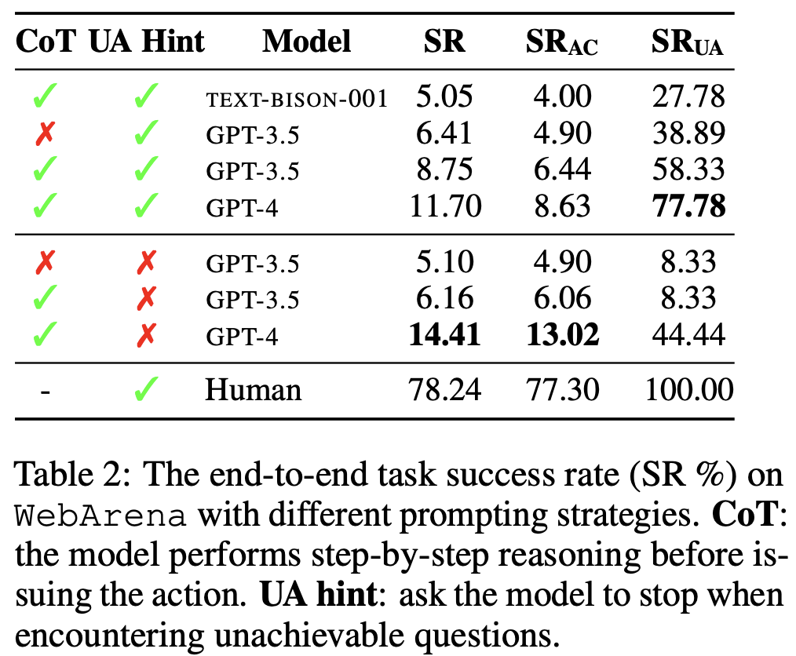
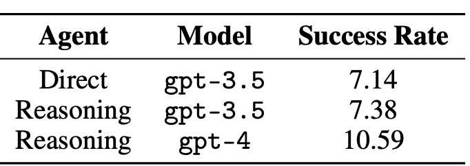

# WebArena Resources
## [12/21/2023] Human Trajectories
We collected human trajectories on 179 tasks and the recording files are [here](https://drive.google.com/drive/folders/1NrN_sawtYK2V_uHnmmS8ugmGIKUAsPgt?usp=sharing).

We sample one task from each template or templates that share similar task semantic. Each file is named as `<task_id>.zip`, and the corresponding template id can be found in the [task config file](../config_files/test.raw.json). The trajectories are presented as playwright trace files. You can view the concrete HTML, network traffic etc by `playwright show-trace <example_idx>.zip`.

Human task success rate: 78.24%


## [11/3/2023] Execution Traces from Our Experiments (v2)

The results on the release v2 can be found in this [folder](https://drive.google.com/drive/folders/1H4wkzDkY2ufiC63DISMXllri0j-ipWcs?usp=sharing). It contains
* text-bison-001 + CoT + UA Hint
* GPT3.5-turbo-0613-16k + Direct + UA Hint
* GPT3.5-turbo-0613-16k + Direct
* GPT3.5-turbo-0613-16k + CoT + UA Hint
* GPT3.5-turbo-0613-16k + CoT
* GPT4-0613 + CoT

## [8/7/2023] Execution Traces from Our Experiments (v1)

The results on the release v1 can be found in this [folder](https://drive.google.com/drive/folders/18Oww0fAgwhuSjSzxUNgzBUlC6M9IZZB2?usp=sharing). It contains
* GPT4-0613 + CoT
* GPT3.5-turbo-0613 + CoT
* GPT3.5-turbo-0613 + Direct


Once you unzip the file with `unzip <file_name>.zip`, you will see a list of `render_*.html`, a log file `merge_log.txt` recording whether an example failed or passed and a `trace` folder containing the `playwright` recording of the executions.

### render_*.html
Each file render the execution trace of the correponding example with (1) the accessibility tree observations, (2) the raw prediction from the agent and (3) the parsed action. We also provide the correponding screenshot of each observation.

To extract specific information from the html, you could use the following code snippet:
```python
from bs4 import BeautifulSoup
with open("render_<id>.html", 'r') as f:
    content = f.read()
    soup = BeautifulSoup(content, 'html.parser')
    # get the observations
    observations = soup.find_all("div", {"class": "state_obv"})
    # urls
    urls = soup.find_all("h3", {"class": "url"})
    # get the raw predictions (e.g, let's think step-by-step ....)
    raw_predictions = soup.find_all("div", {"class": "raw_parsed_prediction"})
    # get the action object
    actions = soup.find_all("div", {"class": "action_object"})
```
### trace/*.zip
The zip files are generated automatically with [playwright](https://playwright.dev/python/docs/trace-viewer). You can view the concrete HTML, network traffic etc by `playwright show-trace <example_idx>.zip`. You will see something like this:

